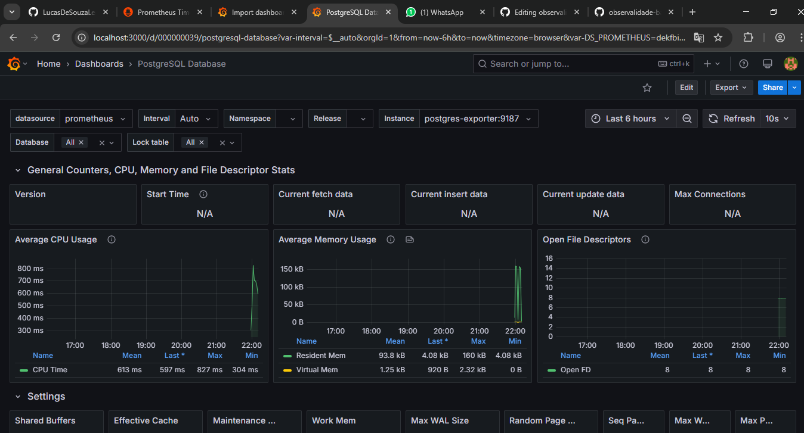

# Aula de Observabilidade - PostgreSQL, Prometheus e Grafana

Este repositório contém uma configuração do Docker Compose para implantar um conjunto de serviços que permite coletar e visualizar métricas de um banco de dados PostgreSQL utilizando Prometheus e Grafana.


### Arquitetura

O stack é composto por 4 serviços principais:

1. **PostgreSQL**: O banco de dados onde os dados são armazenados.
2. **PostgreSQL Exporter**: Coleta métricas do PostgreSQL para o Prometheus.
3. **Prometheus**: Coleta, armazena e consulta métricas de diversos serviços, incluindo o PostgreSQL.
4. **Grafana**: Visualiza as métricas coletadas pelo Prometheus em painéis gráficos interativos.

### Como funciona

- **PostgreSQL**:
  - O banco de dados PostgreSQL é executado dentro de um container Docker com uma configuração padrão.
<<<<<<< HEAD
  - Ele está configurado com um usuário `admin`, senha `minhasenhasecreta` e banco de dados `northwind`.
=======
  - Ele está configurado com um usuário `Lucas`, senha `0000` e banco de dados `banco_escola`.
>>>>>>> 0651d45 (Atualização e implementação de alguns arquivos)
  - As métricas do PostgreSQL serão coletadas através de uma ferramenta chamada *PostgreSQL Exporter*.
  
- **PostgreSQL Exporter**:
  - O `postgres_exporter` conecta-se ao banco de dados PostgreSQL e expõe métricas que são coletadas pelo Prometheus.
  - As métricas podem incluir dados como número de conexões, tempo de resposta, número de transações, etc.

- **Prometheus**:
  - O Prometheus coleta as métricas expostas pelo `postgres_exporter`.
  - Ele está configurado para rodar em uma porta exposta no host, onde você pode acessar sua interface web.

- **Grafana**:
  - O Grafana é usado para visualizar as métricas coletadas pelo Prometheus.
  - Ele permite criar painéis dinâmicos e interativos que mostram o desempenho do PostgreSQL.

### Como iniciar a aplicação

Siga os passos abaixo para configurar e rodar a stack localmente:

1. **Clone o repositório** (caso tenha criado um repositório próprio):

    ```bash
    git clone <URL-do-repositório>
    cd <diretório-do-repositório>
    ```

2. **Verifique o arquivo `docker-compose.yml`**:
   - O arquivo `docker-compose.yml` contém a configuração dos serviços. Certifique-se de que ele está conforme o modelo abaixo (se você não o tiver ainda, pode criar a partir deste código).

3. **Iniciar os containers**:

    Após garantir que o arquivo `docker-compose.yml` está configurado corretamente, execute o seguinte comando para iniciar todos os serviços em segundo plano:

    ```bash
    docker-compose up -d
    ```

4. **Verifique se os containers estão funcionando**:

    Após rodar o comando acima, você pode verificar se os containers foram iniciados corretamente com:

    ```bash
    docker-compose ps
    ```

5. **Acesse as interfaces web**:

    - **Grafana**: Acesse o Grafana em [http://localhost:3000](http://localhost:3000) no seu navegador. A senha padrão do administrador é `admin`, que você pode alterar após o primeiro login.
    - **Prometheus**: Acesse o Prometheus em [http://localhost:9090](http://localhost:9090) para consultar métricas diretamente.
    
    **Observação**: As métricas do PostgreSQL estarão disponíveis no Prometheus por meio do `postgres-exporter` na URL `http://localhost:9187/metrics`.

### Portas expostas

A seguir, estão as portas expostas para os serviços e suas respectivas funcionalidades:

- **PostgreSQL (porta 5432)**:
  - **Porta Exposta**: `5432`
  - **Função**: Conexão com o banco de dados PostgreSQL. Isso permite que outros serviços ou aplicativos se conectem ao banco de dados diretamente.
  
- **PostgreSQL Exporter (porta 9187)**:
  - **Porta Exposta**: `9187`
  - **Função**: Exposição das métricas coletadas do PostgreSQL para que o Prometheus as colete. Você pode acessar as métricas diretamente através dessa URL no navegador: `http://localhost:9187/metrics`.
  
- **Prometheus (porta 9090)**:
  - **Porta Exposta**: `9090`
  - **Função**: Acesso à interface web do Prometheus, onde você pode visualizar as métricas coletadas e fazer consultas. Exemplo de URL para acessar: [http://localhost:9090](http://localhost:9090).

- **Grafana (porta 3000)**:
  - **Porta Exposta**: `3000`
  - **Função**: Acesso à interface web do Grafana, onde você pode visualizar os dashboards e métricas coletadas pelo Prometheus. A URL de acesso será [http://localhost:3000](http://localhost:3000).

### Arquivo `prometheus.yml`

Certifique-se de que o arquivo `prometheus.yml` esteja corretamente configurado para que o Prometheus saiba de onde coletar as métricas. Um exemplo simples de configuração de scrape para o `postgres-exporter` é:

```yaml
scrape_configs:
  - job_name: 'postgres'
    static_configs:
      - targets: ['postgres-exporter:9187']
```
# Meu Projeto

Este é o meu projeto incrível que usa Docker, Prometheus e Grafana para monitorar o banco de dados PostgreSQL.

## Print do Projeto




Este print mostra a interface do Grafana com as métricas do PostgreSQL.
